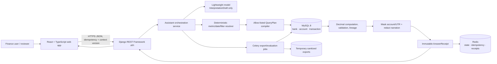
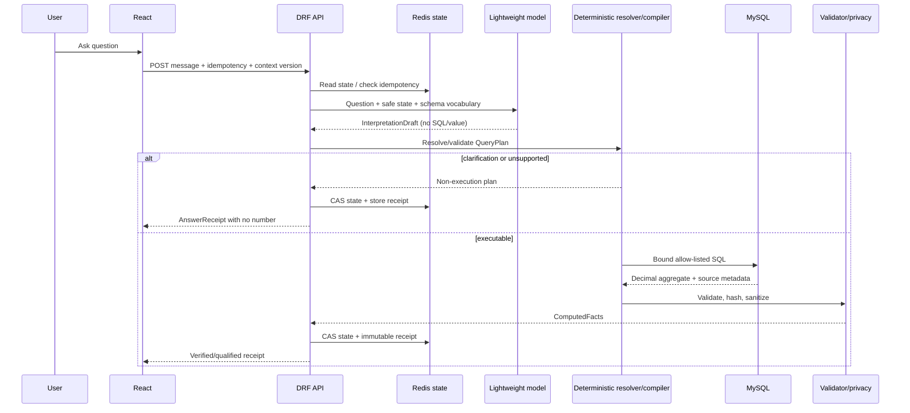

# Architecture

## 1. System context

LedgerProof is a read-only conversational layer over the organiser-provided MySQL database. The
finance source contains only `bank`, `account` and `transaction`. Application state, receipts and
exports are stored outside that source boundary.

The model is not in the database execution path after interpretation. It cannot produce SQL or a
financial value.

---

## 2. Trust boundaries

### Browser boundary

Untrusted user input enters; only sanitized source rows leave. Browser cannot access MySQL, raw
account numbers or raw UTRs. Official totals come from receipts, not browser aggregation.

### Model-provider boundary

Send only current question, compact sanitized QueryState, supported vocabulary and date anchor.
Raw account/UTR/description/table dumps are prohibited. Wording calls receive ComputedFacts only.

### Source database boundary

Runtime user has read-only access. Source schema is immutable for the hackathon. `transaction` is
quoted and session timezone fixed.

### Application-state boundary

Redis contains normalized plans/receipts/state but no raw restricted values. It is not a source of
finance truth.

### Export boundary

Exports are receipt-scoped, sanitized and hash/count verified before delivery.

---

## 3. Backend components

| Component | Responsibility | Must not do |
|---|---|---|
| API layer | transport validation, auth/session placeholder, idempotency/context headers | calculate totals |
| Interpreter | map language to InterpretationDraft | SQL, finance arithmetic, source lookup |
| Resolver | deterministic metrics/dates/entities/limitations/multi-turn patches | query arbitrary fields |
| Compiler registry | known SQL + bound parameters | accept model SQL/identifiers |
| Executor | read-only MySQL execution, Decimal conversion, timeout | call model while DB transaction open |
| Validator | reconcile results, source count/hash, warnings | hide failed required checks |
| Privacy | mask/redact/deny restricted fields | reveal raw value on alternate endpoint |
| Presenter | deterministic or guarded wording | add facts/numbers |
| Receipt store | immutable evidence and replay predicate | overwrite receipt |
| State store | versioned QueryState CAS | accept stale writes |
| Export worker | replay, sanitize, hash/count verify | export browser page/raw sensitive fields |
| Evaluator | read gold cases and score model/pipeline | expose gold to runtime assistant |

---

## 4. Request sequence

---

## 5. Data flow and source lineage

For an aggregate receipt:

1. aggregate query returns value and count;
2. source predicate/template/params are normalized and hashed;
3. source IDs are fetched/streamed in deterministic order and SHA-256 hashed;
4. validation compares counts/components;
5. receipt stores plan/template/hash/count/version;
6. source-record endpoint replays the predicate and sanitizes rows;
7. export replays and verifies hash/count before completion.

At large scale, source IDs can be hashed in a streaming cursor. Do not load millions of IDs into
Redis or model context.

---

## 6. Deployment topology for the hackathon

Minimal:

- React static build on Vercel/Netlify/Cloudflare Pages;
- Django/DRF API on Railway/Render/Fly/VM;
- MySQL managed instance or same private network;
- Redis managed instance;
- Celery worker optional for export/evaluation;
- temporary object storage optional for async exports.

All components can also run locally with Docker Compose for the demo.

The architecture does not require microservices. A modular Django monolith with a separate worker is
faster and safer for the hackathon.

---

## 7. Scaling considerations

- MySQL composite indexes match metric/date/account/bank access patterns.
- Aggregates execute in DB.
- Keyset pagination prevents deep offset scans.
- Query timeouts and result caps protect API.
- Receipt cache avoids repeated identical aggregates for the same dataset version.
- Small model receives compact schemas/state, not records.
- Narration search is explicitly constrained/qualified; it is the least scalable feature.
- Async exports stream rows.
- Application instances are stateless aside from Redis.

The base fixture is not evidence of 20M-record performance. Use the scale helper and measured plans.

---

## 8. Security controls

- read-only DB user;
- network/private DB access;
- bound parameters and identifier allow-lists;
- centralized masking/redaction;
- no sensitive fields in model/log/cache/export;
- escaped React text and CSP;
- spreadsheet-injection protection;
- idempotency/rate limits;
- traceable errors without SQL/data leakage;
- separate evaluation gold boundary.

---

## 9. Architecture decisions

- React rather than server-rendered UI for interactive evidence panels and stateful chat.
- Django/DRF for rapid typed API, MySQL integration and clear service modules.
- Redis rather than finance DB tables for hackathon conversation/receipt state.
- Deterministic compiler rather than text-to-SQL for grounding and model efficiency.
- AnswerReceipt as the UI/API unit rather than plain assistant text.
- MySQL rather than the earlier PostgreSQL plan because the supplied DDL is MySQL-specific.
- No derived vendor/reconciliation source because source truth does not support it.
