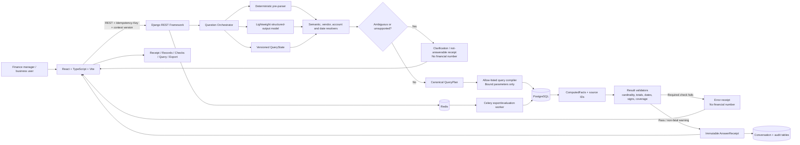

# LedgerProof Architecture

## 1. System context

LedgerProof is a Django/DRF monolith with a React frontend. It is not a set of finance microservices. The core request path is synchronous because the user expects an immediate answer; optional heavy XLSX exports and benchmark runs may use Celery and Redis.



## 2. Trust boundaries

| Boundary | Untrusted input | Required control |
|---|---|---|
| Browser → API | user text, IDs, filters, cursors | serializers, length/enum checks, idempotency, context version |
| Model output → domain | malformed/extra fields, invented IDs | closed Pydantic schema, one bounded repair, deterministic resolver |
| QueryPlan → database | arbitrary fields/joins, injection | allow-listed compiler, bound parameters, read-only role, timeout |
| Database → answer | duplicate joins, nulls, stale/missing links | result checks, lineage, coverage warnings, exact decimals |
| Record/model text → browser | HTML/script/formula payloads | text rendering, CSP, CSV/XLSX sanitisation |
| Receipt → export | dataset drift/recomputation mismatch | source hash/count and immutable snapshot parity |
| Concurrent turns | stale response/state race | expected context version, request sequence, cancellation |

## 3. Backend deployment

```text
Gunicorn + Uvicorn worker
  └─ Django ASGI
      ├─ DRF API
      ├─ question orchestration and query engine
      ├─ conversation/audit persistence
      └─ health/metadata endpoints

Celery worker (optional)
  ├─ large XLSX export
  └─ offline model benchmark

Celery beat is not required unless scheduled benchmark/cleanup tasks are added.
```

## 4. Data architecture

- PostgreSQL finance tables mirror the CSV fixture.
- Analytical views encode safe joins and common signed/reconciliation semantics.
- Application tables store conversations, turns, idempotency, audit metadata, and optional persisted source sets.
- Runtime reads semantic definitions from versioned configuration.
- Evaluation gold is isolated from application imports.

## 5. Query architecture

The compiler is a registry of named operations, not generic text-to-SQL. Example names:

- `completed_payout_total`
- `completed_payout_breakdown_by_vendor`
- `posted_vendor_spend_total`
- `open_reconciliation_list`
- `open_reconciliation_ageing`
- `possible_duplicate_payout_pairs`
- `large_vendor_payout_anomalies`
- `data_freshness_summary`

Each operation declares allowed metric, dimensions, filters, maximum rows, stable sort, SQL template/function, and validation suite.

## 6. Frontend architecture

- route-level pages own URL state;
- TanStack Query owns server state;
- the server QueryState is authoritative;
- evidence opens through query parameters so refresh/navigation work;
- generated/reused API types prevent contract drift;
- official totals are rendered from receipts, never derived from paginated records;
- request cancellation and stale-response guards are mandatory.

## 7. Scale path

For 20M records:

- maintain selective indexes on company/status/date/vendor/account;
- aggregate in PostgreSQL;
- avoid offset pagination;
- use named plans and statement timeouts;
- materialise/persist large result lineages when necessary;
- asynchronously generate large exports;
- benchmark with actual row counts and `EXPLAIN (ANALYZE, BUFFERS)`.

The bundled scale script is a starting point, not proof of 20M performance.
