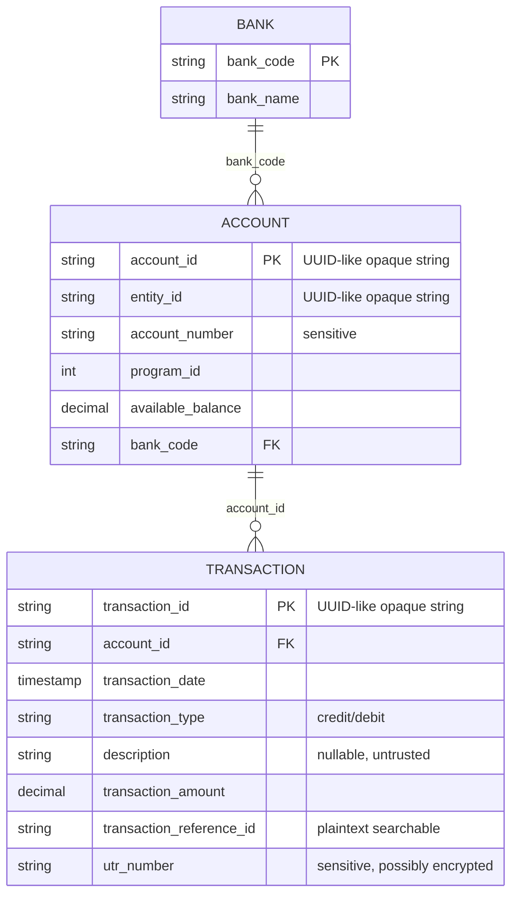

# Finance Assistant — Organiser-Provided Database Schema

This is the source-data contract against which the product must be built and tested. There are
three source tables and one database. Application logs, feedback, conversation state and model
traces are outside this schema and must not be added as finance facts.

## Relationship shape



## `bank`

| Column | Type | Product meaning |
|---|---|---|
| `bank_code` | `VARCHAR(10)` | Primary key and canonical IFSC-prefix-like code. |
| `bank_name` | `VARCHAR(150)` | Canonical formal bank name. Answers must use values present in this table. |

## `account`

| Column | Type | Product meaning |
|---|---|---|
| `account_id` | `VARCHAR(36)` | Primary key. Treat as an opaque string rather than coercing into a native UUID. |
| `entity_id` | `VARCHAR(36)` | Entity that owns the account; no entity-name table exists. |
| `account_number` | `VARCHAR(20)` | Sensitive. Mask except last four; do not expose to the model. |
| `program_id` | `INT` | Product/program identifier. A documented `04` is integer `4`. |
| `available_balance` | `DECIMAL(15,2)` | Current snapshot; may be negative. It does not provide historical balances. |
| `bank_code` | `VARCHAR(10)` | Foreign key to `bank.bank_code`. |

## `transaction`

| Column | Type | Product meaning |
|---|---|---|
| `transaction_id` | `VARCHAR(36)` | Primary key; opaque string. |
| `account_id` | `VARCHAR(36)` | Foreign key to `account.account_id`. |
| `transaction_date` | `TIMESTAMP(6)` | The only transaction date. Use half-open date ranges. |
| `transaction_type` | `ENUM('credit','debit')` | Direction of movement. |
| `description` | `VARCHAR(500)` nullable | Unstructured bank narration; not a canonical vendor or category. |
| `transaction_amount` | `DECIMAL(15,2)` | Absolute amount. Type provides direction. |
| `transaction_reference_id` | `VARCHAR(64)` nullable | Plaintext reference; default meaning of “reference number.” |
| `utr_number` | `VARCHAR(256)` nullable | Sensitive and potentially encrypted/tokenized. |

## Canonical DDL

The raw table name `transaction` is a SQL keyword in MySQL contexts, so repository SQL quotes it
with backticks even though the organiser excerpt did not.

```sql
CREATE TABLE `bank` (
    `bank_code` VARCHAR(10) PRIMARY KEY,
    `bank_name` VARCHAR(150) NOT NULL
) ENGINE=InnoDB DEFAULT CHARSET=utf8mb4;

CREATE TABLE `account` (
    `account_id` VARCHAR(36) PRIMARY KEY,
    `entity_id` VARCHAR(36) NOT NULL,
    `account_number` VARCHAR(20) NOT NULL,
    `program_id` INT NOT NULL,
    `available_balance` DECIMAL(15,2) NOT NULL DEFAULT 0.00,
    `bank_code` VARCHAR(10) NOT NULL,
    FOREIGN KEY (`bank_code`) REFERENCES `bank` (`bank_code`)
) ENGINE=InnoDB DEFAULT CHARSET=utf8mb4;

CREATE TABLE `transaction` (
    `transaction_id` VARCHAR(36) PRIMARY KEY,
    `account_id` VARCHAR(36) NOT NULL,
    `transaction_date` TIMESTAMP(6) NOT NULL,
    `transaction_type` ENUM('credit','debit') NOT NULL,
    `description` VARCHAR(500) DEFAULT NULL,
    `transaction_amount` DECIMAL(15,2) NOT NULL DEFAULT 0.00,
    `transaction_reference_id` VARCHAR(64) DEFAULT NULL,
    `utr_number` VARCHAR(256) DEFAULT NULL,
    FOREIGN KEY (`account_id`) REFERENCES `account` (`account_id`)
) ENGINE=InnoDB DEFAULT CHARSET=utf8mb4;
```

The executable version is `database/schema.sql`.

## Preserved seed banks

```text
HDFC  HDFC BANK LIMITED
ICIC  ICICI BANK LIMITED
SBIN  STATE BANK OF INDIA
UTIB  AXIS BANK LIMITED
KKBK  KOTAK MAHINDRA BANK LIMITED
CNRB  CANARA BANK
UBIN  UNION BANK OF INDIA
AUBL  AU SMALL FINANCE BANK LIMITED
TMBL  TAMILNAD MERCANTILE BANK LIMITED
RATN  RBL BANK LIMITED
```

The exact ten provided accounts and transactions are constants in
`scripts/generate_dataset.py` and are asserted in regression tests. The expanded CSV fixture does
not alter those records.

## Reference-number decision

Users colloquially use “ref no” for multiple identifiers, but this product makes a deterministic
choice:

1. Bare “reference number”, “transaction reference”, or “receipt number” means
   `transaction_reference_id`.
2. It uses exact, case-sensitive equality and may return multiple rows because the source column
   is not unique.
3. It never silently falls back to `utr_number`.
4. Explicit UTR lookup is disabled in the default encrypted/tokenized storage mode. Supporting it
   later requires an approved secure lookup adapter or searchable keyed digest; decrypting all rows
   for every query is not acceptable.
5. UTR values are always masked in records and exports.

## Source limitations that must remain visible

- There is no vendor table or payee identity.
- There is no payout table or payout status.
- There is no reconciliation status, matched amount or outstanding amount.
- There is no chart of accounts or transaction category.
- There is no balance-history table.
- There is no entity-name table.
- There is no currency field; the hackathon assumption supplies a single currency.

The assistant must refuse or qualify requests that require these missing facts rather than infer
material financial classifications from narration text.
